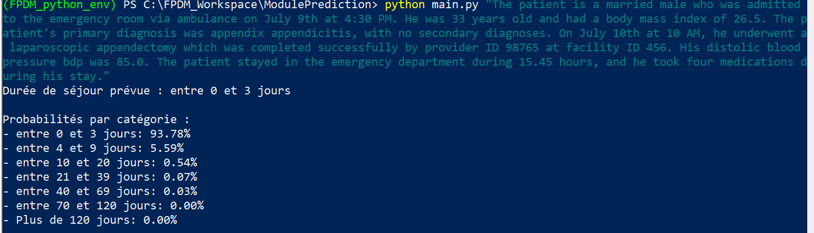
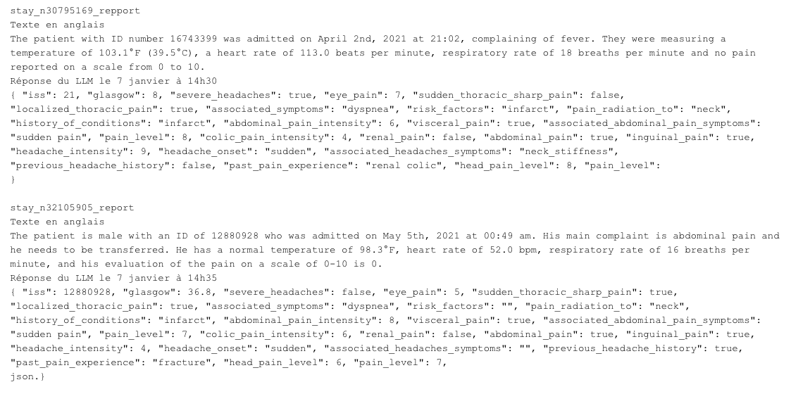
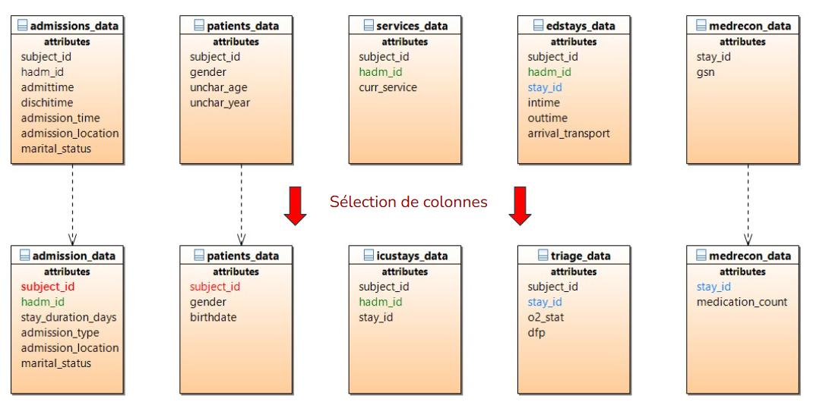

# FPDM: AI for hospital patient-flow prediction

A hospital generates thousands of clinical reports, prescriptions and notes, but most of it lives in free-text fields no system can query. Over 18 months, a team of 12 students at Centrale Lille built a tool that reads these unstructured records, indexes them with a locally-run LLM, triages patients by criticality and predicts length of stay, for CHU de Lille and SIB, editor of the Sillage patient-record software used in 80% of French hospitals.

**This is a project showcase repository: the source code is private at the hospital partners' request.** The figures and the two project reports (French) below document the work.

## My role

I led the length-of-stay prediction team: turning raw clinical data into forecasts useful to caregivers, and contributing to the scientific writing.

## What the system does

1. **Extraction**: a local LLM (OpenHermes 2.5, Mistral 7B via llama.cpp) turns free-text medical reports into structured JSON records.
2. **Prediction**: an XGBoost classifier (with PCA reduction), trained on 300,000 patients from the MIMIC-IV database, predicts length of stay in 7 categories with per-category probabilities.
3. **Triage**: rule-based and AI-assisted triage of incoming patients, plus an API and interface for hospital staff.

## Results

- Tool delivered to the hospital for production use, after 10 iterations with medical staff and over 1,800 hours of cumulative work.
- Project approach published at the IEEE SMC international conference: Bensafir et al., "A Large Language Model-enhanced expert system for patient triage in Emergency Department and a Machine Learning Classifier for hospital admissions forecasting", IEEE SMC, Vienna, 2025. [Open access on HAL](https://hal.science/hal-05289706).

## Figures

| | |
|---|---|
|  |  |

## Reports

- [User report](report/rapport-utilisateur.pdf) (French)
- [Technical report](report/rapport-technique.pdf) (French)

## Team and context

A Centrale Lille group project (2023 to 2025, 12 students) with CHU de Lille and SIB. Data: MIMIC-IV under the PhysioNet credentialed data use agreement; no patient data is included in this repository. More on my [portfolio](https://ugo-roccamatisi.github.io).
